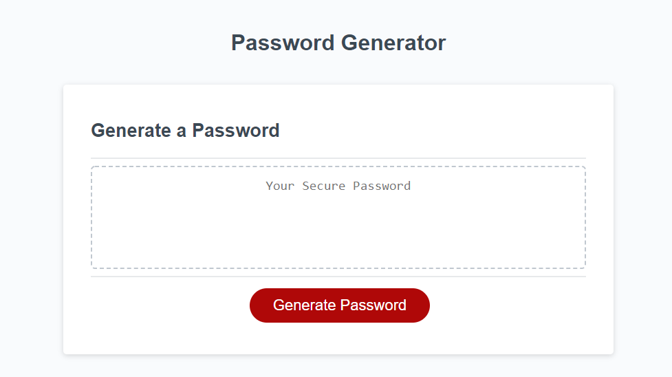

# Password-Generator

## Overview:

Have you ever had a hard time with coming up with a password that guarantees your privacy? Well, here is what you've been looking for! Brought to you by Daniel Phan, is a random password generator that will satisy all of your needs. With this password generator, there are some minimum requirements that need to be met. The minimum requirements are that the number of characters must be between 8 and 128, and either 1 lowercase, uppercase, number, or special character. With these requirements, a secure password is generated for whatever your needs may be! 

## Activity:

For this activity, we're building a password generator that meets the minimum requirements through JavaScript. This password will provide great security for any sensitive data. We're given a starter code that we have to build upon. As mentioned above, this password generator has some requirements such as:

1. When 'Generate Password' is clicked, then you're prompted with a series of prompts
2. Each prompt will alert the user with which criteria to include in the password
3. Password length must be between 8 to 128 characters
4. Password must include at least 1 lowercase, uppercase, number, or special character
5. User input should be stored and validated 
6. Last but not least, the generated password will be displayed in an alert or written to the page

Below is a screenshot of what the password generator will look like:

Feel free to navigate to my password generator if you have any sensitive data that needs to be secured! [Password-Generator](https://dannyphan6.github.io/Password-Generator/)

